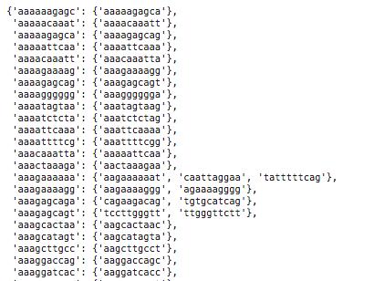

# QuickGG - Quick Graphs for Genomes
</a>
      

## Abstract
An automated pipeline to build graphs quick using kmer approach.
There are several sequences across human genome, viruses and also among other species that have conserved and variable regions. These regions of are interest to the scientific community because of its dynamic characteristic. We want to be able to build graphs using alternative references that are representative of sequence of interest and also **fast**. One of the most common steps in building graphs requires performing multiple sequence alignment (MSA) which is computationally expensive. This step can be avoided by uisng a kmer based approach using the _**QuickGG**_ tool. 

Fig: Genome graph of MHC gene built using 128-mers and seven alternative contigs of MHC gene

## Objective 

The primary objective is to build an open-source platorm tool that builds a genome graph by eluding the use of massive amounts of compute and/or advanced algorithms.

We can construct graph genomes of a small portion of the genome that can still lead to interesting insights and can be built, rendered, and analyzed using **memory and compute power equivalent to that of a local-CPU.**  We also want to be able to use **publicly accessible, easy-to-obtain data.**

## Getting Started
Follow the simple three step process to build and visualize amazing graphs
### Download Test Data
For test data, we will download and process seven alternative contigs of MHC sequences available from the GRCh38 genome.
- Add Reference of dataset download
### Requirements
- Python 3.7
- Jellyfish (k-mer counter) - **TBCited**
### Build Graphs
- Alternatively, the following docker image and CWLTool can be used
Running command (CWL, Docker Image, etc.)

## Methods

### Initial Algorithm Idea: K-mers

### Graph Representation

Starting with a list of sequences

1. Find all possible k-mers (of a fixed k) in all possible sequences.

We create a table of every possible kmer in every sequence.

2. Find which k-mers are repeats (occur multiple times in the same sequence) and get rid of them.

3. Find which k-mers occur in multiple sequences and keep them.

4. Order the k-mers within each sequence 

5. Covert this to a graph-structure. (vertex: {connected vertices})

#### Next steps

We want to be able to collapse all kmers that are directly next to each other (ie ATTTGGTTAA, TTTGGTTAAG, TTGGTTAAGC becomes ATTTGGTTAAGC)

We also want to rid this graph of cycles for easier downstream processing.

We want to experiment with different k values.

### Graph Rendering

We used Gephi to visualize this graph. We use the ??? settings, which optimizes graphs like this for human viewing, using physics-based rules to maximize distance between "strands".  Here are some examples below (MHC region subsampled, HIV)

## Future Work
This work can then be extrapolated to 

### Understanding new sequences from the model.

We would like to be able to use this graph model to be able to analyze a new sequence, and understand where it's structural variation occurs (ie which "path" on the graph it follows"). 
