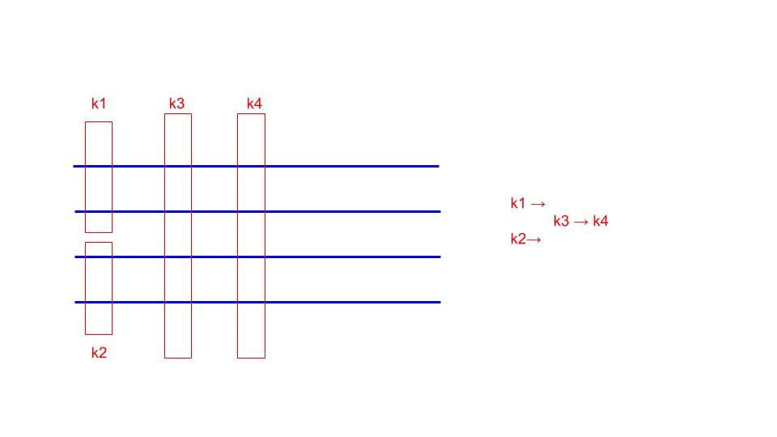
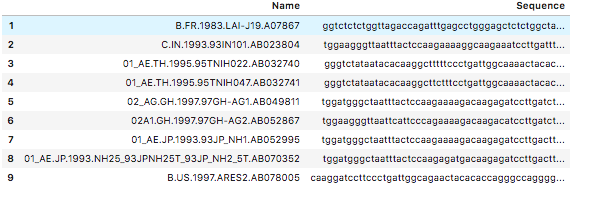
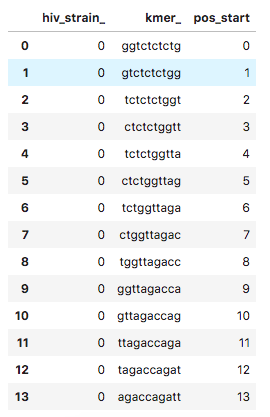
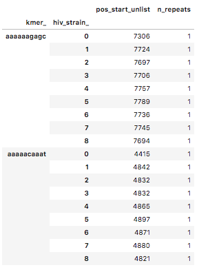
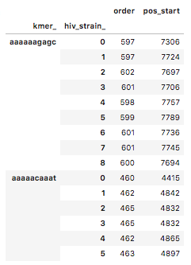

# Quick and Dirty Graph Genomes

Graph Genomes are so HOT right now.  But they're also scary. (See below for my personal opinion of a good symbol of hot and scary.)

We hope to show that you don't need massive amounts of compute and super fancy algorithms to find graph genomes useful.

We can construct graph genomes of a small portion of the genome that can still lead to interesting insights and can be built, rendered, and analyzed using memory and compute power equivalent to that of a local-CPU.

## Aims

We want to be able to build a graph representation of and visualize a highly variable portion of the genome.

Aim 1: Build a graph of the MHC region in the human genome using the 8 alternative sequences from HGR38.

Aim 2: Visualize this graph!

Aim 3: Validate how well the graph representation works using simulations (deleting/inserting/mutating bases from these alternative reference sequences) or sequences from alternative dataset (1kg).

Aim 4: Extend to another region, or use alternative dataset (1kg) to train/construct the graph.

## Algorithm

## Initial Algorithm Idea: K-mers

## Graph Representation

Starting with a list of sequences

1. Find all possible k-mers (of a fixed k) in all possible sequences.

We create a table of every possible kmer in every sequence.

2. Find which k-mers are repeats (occur multiple times in the same sequence) and get rid of them.

3. Find which k-mers occur in multiple sequences and keep them.

4. Order the k-mers within each sequence 

5. Covert this to a graph-structure. (vertex: {connected vertices})

### Next steps

We want to be able to collapse all kmers that are directly next to each other (ie ATTTGGTTAA, TTTGGTTAAG, TTGGTTAAGC becomes ATTTGGTTAAGC)

We also want to rid this graph of cycles for easier downstream processing.

We want to experiment with different k values.

## Graph Rendering

We used gephi to visualize this graph. We use the ??? settings, which optimizes graphs like this for human viewing (using physics-based rules to maximize distance between "strands".

## Understanding new sequences from the model.

We would like to be able to use this graph model to be able to analyze a new sequence, and understand where it's structural variation occurs (ie which "path" on the graph it follows"). 
