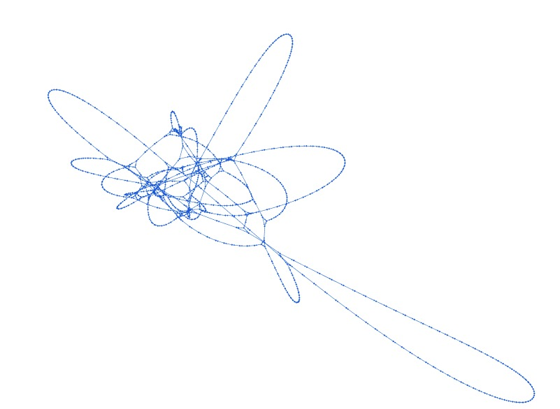
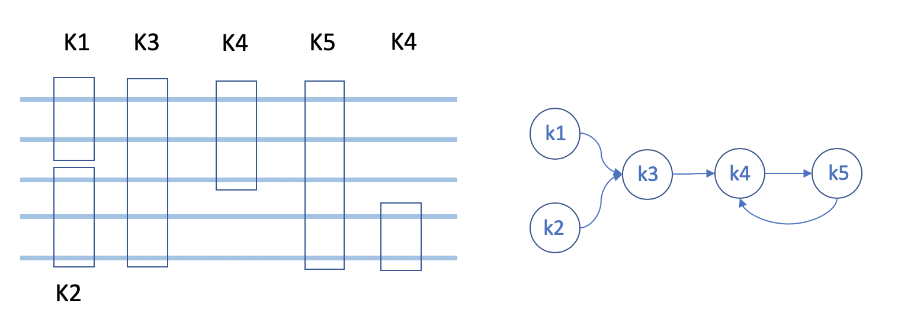
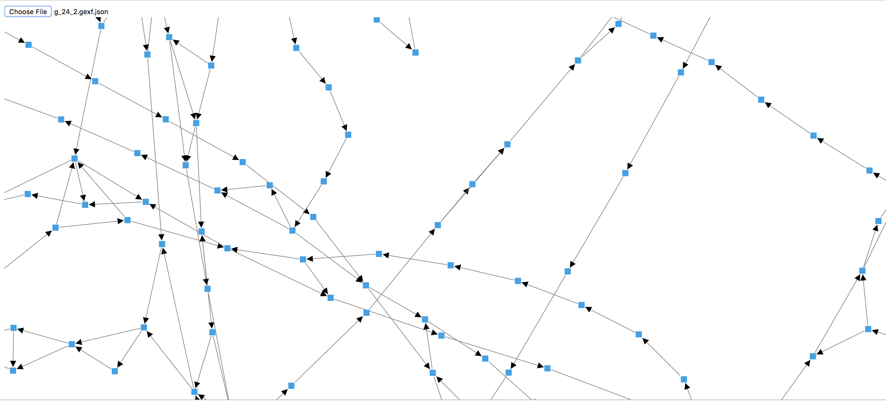
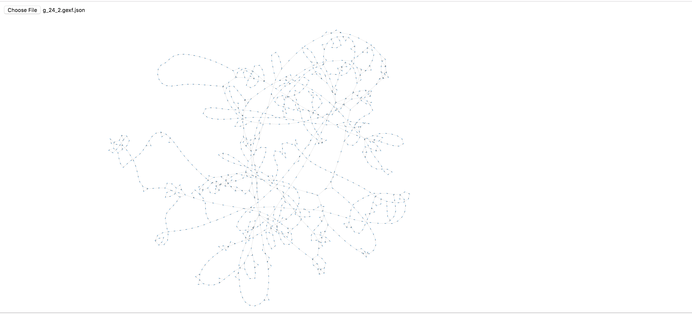
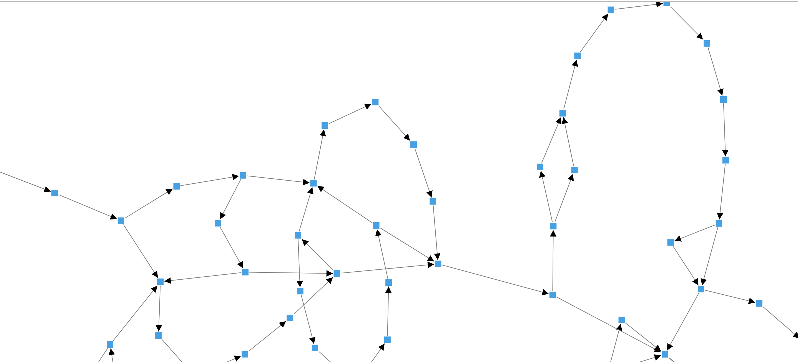

</a> 
# SWIGG - SWIft Genomes in a Graph

A pipeline for making SWIft Genomes in a Graph (SWIGG) using k-mers. We follow a multiscale approach to build genome graphs in an hierarchial way.

## Abstract
An automated pipeline to build graphs quickly using kmer approach.
There are regions across the human genome that are **conserved** among species while bearing modest amount of **variability**. The dynamic characteristics of these regions are suitable for understanding relationships of genome structure among individuals and/or organisms. Such relationships are best represented with grpahs. Building graphs for genomes, or large genomic regions is computationally  expensive. Using a multi-scale approach we created a simple algorithm and tool to build genome graphs **fast**.

This approach captures variations in an hierarchial way. The idea is to create a sparse representation of large scale differences (anchors) so as to allow visualizing the entire genome in a succinct way. These "anchored" graphs can then be further iteratively improved to include local sequence differences, and in turn, help us with genotyping existing variants and identifying new variants in new genomes.

_**SWIGG**_ is a fast and efficient tool that can do this. The following is a graph created using SWIGG in less than three minutes that uses 128-mers and builds on seven alternative haplotypes of the human MHC region (4.5Mb in size).


<br/>
Fig: Genome graph built using 128-mers and seven alternative contigs of MHC gene

## Objective 

The primary objective is to build an open-source platorm tool that builds a genome graph by eluding the use of massive amounts of compute and/or advanced algorithms.

We can construct graph genomes of a small portion of the genome that can still lead to interesting insights and can be built, rendered, and analyzed using **memory and compute power equivalent to that of a local-CPU.**  We also want to be able to use **publicly accessible, easy-to-obtain data.**

## Getting Started

### Meet the Software Requirements OR Docker
#### Software Requirements
- Python 3.7
  - numpy (1.16.4)
  - pandas (0.24.2)
  - biopython (1.74)
  - networkx (2.3)
  - argparse
  - collections
- Gephi
#### Docker
The Docker image with the required dependencies and the script is on DockerHub - `ncbicodeathons/swigg:0.0.1`
The following commands can be executed to run the Docker image -
- `docker pull ncbicodeathons/swigg:0.0.1`
- `docker run -it ncbicodeathons/swigg:0.0.1 /bin/bash`
  
Follow the **simple three step process** to **build and visualize** beautiful graphs using a list of fasta sequences. For our example, we use a region known to have high variation across humans - the MHC gene region which is 4.5Mb in size and known ot have conserved and variable regions.

### Download Data
For data to construct the graph, we used the alternative sequences of the MHC region given in the latest reference Human Genome (HGR38). These were downloaded using NCBI accession numbers [GL000250](https://www.ncbi.nlm.nih.gov/nuccore/GL000250/), [GL000251](https://www.ncbi.nlm.nih.gov/nuccore/GL000251/), [GL000253](https://www.ncbi.nlm.nih.gov/nuccore/GL000253/), [GL000254](https://www.ncbi.nlm.nih.gov/nuccore/GL000254/), [GL000255](https://www.ncbi.nlm.nih.gov/nuccore/GL000255/) and [GL000256](https://www.ncbi.nlm.nih.gov/nuccore/GL000255/).

### Build and Render Graphs
In order to build a graph, you can run swigg.py with the following arguments:

- `--kmer-length (-k)`: The minimum length of a k-mer.
- `--fasta (-f)`: List of fasta sequence file locations.
- `--out (-o)`: File location for the output edge file (csv format) to be written.
- `--repeat_threshold_within (-rw)`: The maximum number of repeats within a single sequence for a k-mer to be considered "unique" within that sequence.  (See example below)
- `--repeat_threshold_across (-ra)`: The maximum number of repeats within any sequence for a k-mer to be kept (see example below)
- `--threshold (-t)`: The number of sequences a k-mer must occur in in order to be kept (see example below).

#### Example

The various threshold parametrs are a bit confusing, so we give an example of the workflow.  Let's say we have chosen `kmer-length=2`, `repeat_threshold_within=1`, and `repeat_threshold_across=2`, and `threshold=2`.  The k-mers found in each sequence are the following (with k-mers conserved across sequences bolded).

```
GGAATAAGAAGG: GG, GA, AA, AT, TA, AA, AG, GA, AA, AG, GG

GGTAATAAGG: GG, GT, TA, AA, AT, TA, AA, AA, AG, GG

GGTGGTAA: GG, GT, TG, GG, GT, TA, AA
```

Some of these k-mers are only found in one sequence (threshold) so we throw them out.

```
AATAAGAA: GG, GA, AA, AT, TA, AA, AG, AA,  AG, GG

GGTAATAAGG: GG, GT, TA, AA, AT, TA, AA, AG, GG

GGTGGTAA: GG, GT, GG, GT, TA, AA
```

```GG``` occurs more than 1 time (repeat_threshold_within) so we throw that out.

```
AATAAGAA: GA, AA, AT, TA, AA, AG, AA,  AG

GGTAATAAGG: GT, TA, AA, AT, TA, AA, AG

GGTGGTAA: GT, GT, TA, AA
```

```AA``` occurs more than 2 times (repeat_threshold_across) in at least one sequence (sequence 1), so we throw that out.  We end up with the following k-mers for each of the sequences:

```
AATAAGAA: GA, AT, TA, AG,  AG

GGTAATAAGG: GT, TA, AT, TA, AG

GGTGGTAA: GT, GT, TA
```

#### Use Case using test dataset

```
# Login through the docker image - 
docker pull ncbicodeathons/swigg:0.0.1
docker run -it ncbicodeathons/swigg:0.0.1 /bin/bash

# Download test data
git clone https://github.com/NCBI-Codeathons/SWIGG.git
cd SWIGG/

# Run SWIGG
swigg.py -k 50 -t 2 -rw 1 -ra 1 -o output_mhc_alt \
-f test/fasta/GL000250.fa \
test/fasta/GL000251.fa \
test/fasta/GL000252.fa \
test/fasta/GL000253.fa \
test/fasta/GL000254.fa \
test/fasta/GL000255.fa \
test/fasta/GL000256.fa 
```

## Methods


### Initial Algorithm Idea: K-mers


## Results (Graphs)


<br/>
Fig: Genome graph built using 128-mers and seven alternative contigs of MHC gene

## Other Graphs constructed
This following are other graphs created using different set of parameters


</br> 
Fig: Graph for MHC region with 31-mers where k-mers are present in at least 5/7 alternative contigs.


</br> 
Fig: Graph for HIV viral genome (10kb) for ten genomes using 10-mers.

## Future Direction

1. Many k-mers happen to be adjacent to each other, which actually is just one large k-mer. We would like to merge these small k-mers to a merge larger k-mers.
2. We would also like to further improve the graph by iterating over local sequences
3. Now that we have a tool for generating genome graphs quickly and efficiently, it’s desirable to find the optimal parameters, e.g. size of kmer, occurrence of a kmer to determine whether it is to be retained or not. This remains challenging because there is no simple way to evaluate genome graphs. Numbers of vertices and edges can be starting points. We would like to have comprehensive investigation of potential factors.

## Understanding new sequences from the model.

We would like to be able to use this graph model to be able to analyze a new sequence, and understand where it's structural variation occurs (ie which "path" on the graph it follows"). 

## Graph Visualization
We implemented an interactive large scale graph visualization web application to visualize the "k-mer" signature structure dynamically. The library we used is capable of rendering 10,000 nodes in the browser. The direction of the arrow indicates the order of two "k-mer"s.  Each sequence segment is a node, and every pair is an edge in the graph. A file selection button is provided for uploading user-defined "k-mer" inputs.
</a>
<br/><br/><br/><br/><br/><br/>
</a>
<br/><br/><br/><br/><br/><br/>
</a>
<br/><br/><br/><br/><br/><br/>

